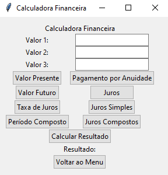

# Calculadora Financeira com Interface Gráfica (Python + Tkinter)

Este repositório contém o código de uma calculadora financeira desenvolvida como parte de um projeto extensionista na faculdade. O aplicativo foi criado em Python com interface gráfica do Tkinter e oferece uma ferramenta prática e acessível para cálculos financeiros, com foco em três áreas principais: **juros compostos**, **simulações de investimentos** e **planejamento de orçamentos pessoais**.

---

## Objetivo do Projeto

Oferecer aos usuários uma ferramenta que facilite a realização de cálculos financeiros e matemáticos, através de uma interface acessível e amigável, contribuindo para o planejamento e controle financeiro.

## Funcionalidades

O projeto é composto por três calculadoras distintas, acessíveis em uma única interface com botões para cada uma:

1. **Calculadora Simples**: Realiza operações básicas, como soma, subtração, multiplicação e divisão. Ideal para cálculos cotidianos rápidos.
2. **Calculadora Matemática**: Oferece operações avançadas, como exponenciação, radiciação, porcentagem, cálculo de fatoriais, regra de três simples (direta e inversa) e logaritmos.
3. **Calculadora Financeira**: Focada em cálculos financeiros, incluindo valor presente, valor futuro, taxa de juros, períodos compostos, pagamentos anuais, além de juros simples e compostos. Essa seção permite simulações de cenários financeiros para auxiliar na tomada de decisões.

## Captura de Tela




## Tecnologias Utilizadas

- **Linguagem**: Python
- **Biblioteca de Interface Gráfica**: Tkinter
- **IDE**: Visual Studio Code (VSCode)

## Estrutura do Código

A aplicação é dividida em uma janela principal (`frame_principal`) que redireciona o usuário para os frames das três calculadoras. Cada frame contém os widgets específicos para a calculadora selecionada e as operações são organizadas em um módulo externo de operações matemáticas e financeiras.

### Funções principais

1. **Interface e Navegação**:
   - `frame_menu`: Exibe o menu principal.
   - `frame_calculadora_simples`: Configura a Calculadora Simples e seus botões.
   - `frame_calculadora_matematica`: Exibe opções avançadas de cálculo com atualizações dinâmicas de campos.
   - `frame_calculadora_financeira`: Configura a Calculadora Financeira e permite selecionar diferentes operações financeiras.

2. **Funções de Operações**:
   - Localizadas no módulo `modulo_de_operacoes`, que contém funções para exponenciação, radiciação, cálculo de juros, entre outras.

## Como Executar o Projeto

1. Clone o repositório:

   ```bash
   git clone https://github.com/seu_usuario/calculadora_financeira.git
   cd calculadora_financeira
   ```

2. Certifique-se de ter o Python instalado. Recomenda-se a versão >= 3.6.

3. Execute o arquivo principal:

   ```bash
   python main.py
   ```

## Estrutura do Repositório

```text
calculadora_financeira/
├── modulo_de_operacoes.py  # Módulo com as funções matemáticas e financeiras
├── main.py                 # Arquivo principal com a interface gráfica e as funcionalidades
├── README.md               # Documentação do projeto
└── LICENSE.txt             # Licença do projeto
```

## Contribuindo

Este projeto é aberto para contribuições. Sinta-se à vontade para fazer um fork e enviar um pull request com melhorias.

## Licença

Este projeto está licenciado sob a Licença MIT - veja o arquivo [LICENSE](LICENSE) para mais detalhes.

--- 

Essa estrutura ajudará a organizar a documentação no GitHub e fornecer um guia completo para usuários e colaboradores.
